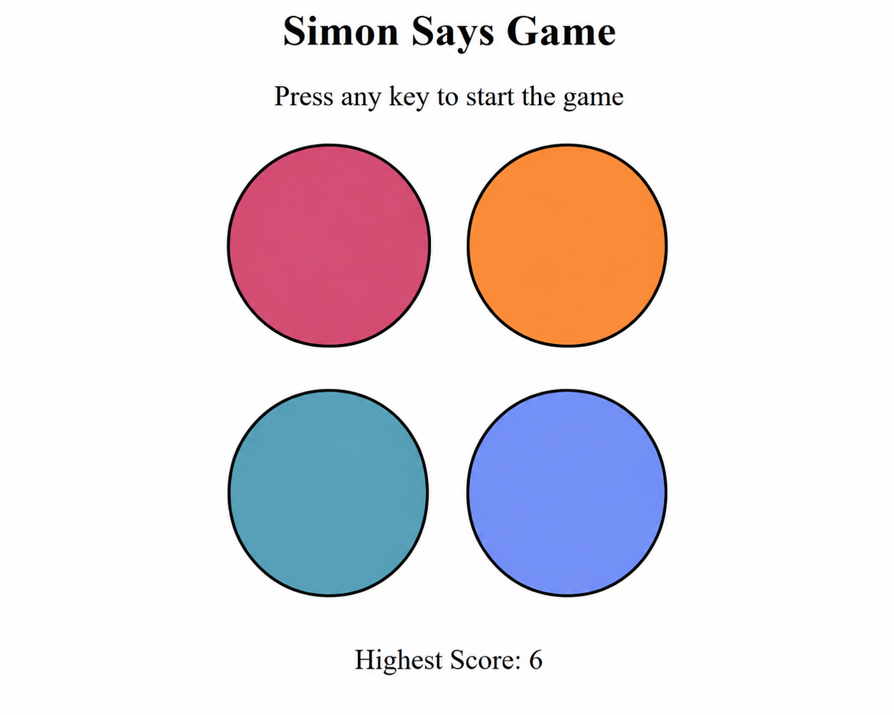

# 🎮 Simon Says Game

A simple and interactive **Simon Says memory game** built using **HTML, CSS, and JavaScript**.

This is a beginner-friendly frontend project created to practice **JavaScript logic, DOM manipulation, event handling, arrays, functions, and CSS animations**.

## 🚀 Features

* 🎮 Random color sequence generation
* 🧠 Memory-based gameplay
* 📈 Increasing difficulty with each level
* 🏆 Highest score tracking
* ✨ Button flash animations
* 🟢 Green flash for correct user input
* 🔴 Red flash when the game is over
* 📱 Responsive design for smaller screens
* ⌨️ Press any key to start the game

## 🛠️ Technologies Used

* **HTML5** — Structure
* **CSS3** — Styling, animations, and responsive design
* **JavaScript** — Game logic and DOM manipulation

## 📂 Project Structure

```text
simon-says/
│
├── index.html
├── style.css
├── app.js
└── README.md
```

## 🎮 How to Play

1. Press **any key** to start the game.
2. The game will flash one of the four colored buttons.
3. Remember the color that flashed.
4. Click the buttons in the same order as the sequence.
5. Every successful round adds a new color to the sequence.
6. The game continues until you click the wrong button.
7. Your highest score is displayed during the game.

## 🧠 What I Practiced

While building this project, I practiced:

* Selecting elements using `querySelector()` and `querySelectorAll()`
* Handling keyboard and mouse events
* Using arrays to store game and user sequences
* Generating random values using `Math.random()`
* Using functions to organize game logic
* Using `setTimeout()` for animations and delays
* Manipulating CSS classes with `classList`
* Tracking game state with JavaScript variables
* Creating responsive layouts using CSS media queries
* Implementing a simple memory-based game algorithm

## 📱 Responsive Design

The game is responsive and adjusts its layout according to the screen size.

On smaller screens:

* The game buttons become larger relative to the screen
* The game container adjusts its size
* The button layout remains centered and accessible

## 📸 Preview

Add a screenshot of your game here:

```markdown

```

## 🔮 Future Improvements

Some features I may add in the future:

* 🔊 Sound effects for each button
* 🏆 Persistent high score using `localStorage`
* ⏱️ Timer or speed-based challenges
* 🎨 More animations
* 📊 Score history
* 📱 Improved mobile UI

## 👨‍💻 About

This project was created as a **beginner JavaScript project** to strengthen my frontend development fundamentals and practice creating interactive browser-based games.

---

⭐ If you like this project, feel free to star the repository!
