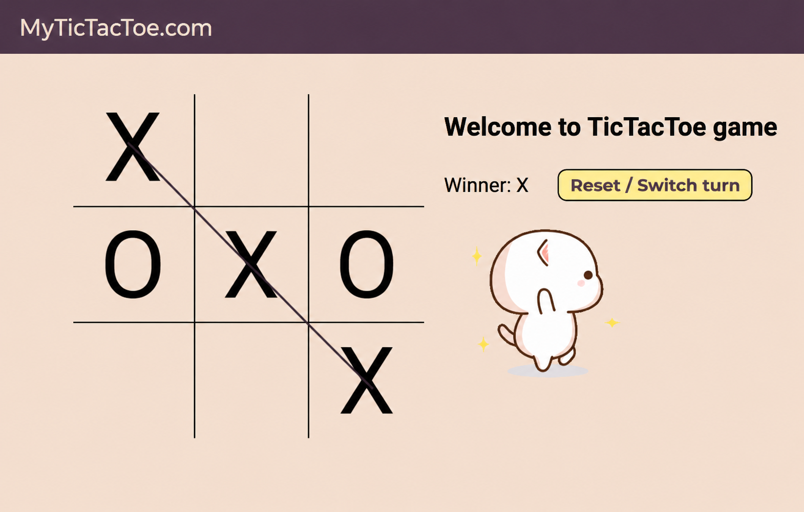

# 🎮 Tic-Tac-Toe Game

A simple and interactive **Tic-Tac-Toe game** built using only **HTML, CSS, and JavaScript**.

This is one of my beginner frontend projects, created to practice **DOM manipulation, JavaScript logic, event handling, CSS styling, and responsive design**.

## 🚀 Features

* 🎯 Two-player Tic-Tac-Toe
* ❌ X and ⭕ O turns
* 🏆 Winner detection
* 🔄 Reset / Switch Turn button
* 🔊 Click and game-over sound effects
* 🎉 Winning animation
* 📱 Responsive design for smaller screens
* ✨ Hover effects on game boxes
* 🎨 Custom styling with Google Fonts

## 🛠️ Technologies Used

* **HTML5** — Structure
* **CSS3** — Styling, animations, and responsive design
* **JavaScript** — Game logic and DOM manipulation

## 📂 Project Structure

```text
tic-tac-toe/
│
├── index.html
├── style.css
├── app.js
│
├── ting.mp3              # 🔊 Audio Asset
├── gameover.mp3          # 🔊 Audio Asset
├── music.mp3             # 🎵 Audio Asset
├── excited.gif           # 🎞️ GIF Asset
├── TicTacToePreview.png  # 🖼️ Preview Asset
│
└── README.md
```

## 🎮 How to Play

1. Player **X** starts the game.
2. Players take turns clicking an empty box.
3. The first player to get three symbols in a row wins.
4. The winning combination is highlighted with a line.
5. Use **Reset / Switch Turn** to start a new game or change the starting player.

## 🧠 What I Practiced

While building this project, I practiced:

* Selecting HTML elements using `querySelector()` and `querySelectorAll()`
* Handling click events with `addEventListener()`
* Manipulating HTML using `innerText`
* Using arrays and loops
* Creating and using JavaScript functions
* Managing game state with variables
* Working with audio using the `Audio` API
* Using CSS transitions and transforms
* Creating responsive layouts with media queries
* Detecting the winner using predefined winning combinations

## 📱 Responsive Design

The game adjusts its layout based on screen width using CSS media queries.

On smaller screens:

* The game board becomes smaller
* Game information moves below the board
* Font sizes and button sizes are reduced

## 📸 Preview

You can add a screenshot of your game here:

```markdown

```

## 🔮 Future Improvements

Some features I may add in the future:

* 🤖 Single-player mode with AI
* 🧮 Score tracking
* 🏅 Draw detection
* 🌙 Dark mode
* 🎨 Better animations
* 📱 Improved mobile UI

## 👨‍💻 About

This project was created as a **beginner JavaScript project** to strengthen my frontend development fundamentals and practice building interactive web applications.

---

⭐ If you like this project, feel free to star the repository!
